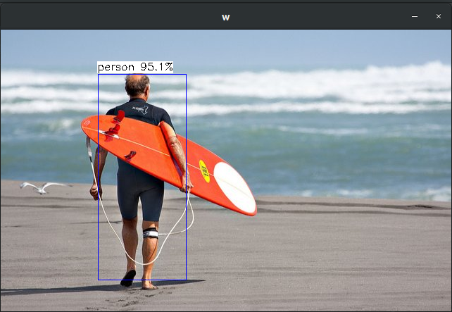

# MNN-yolov3
```
./yolo.out path.mnn images.txt classes.txt
```

CSDN博客 : [yolov3使用MNN框架推理C++版](https://blog.csdn.net/ljx123_/article/details/121561603?spm=1001.2014.3001.5501)

效果展示:&emsp;
<center class="half">
  <br>
</center>

